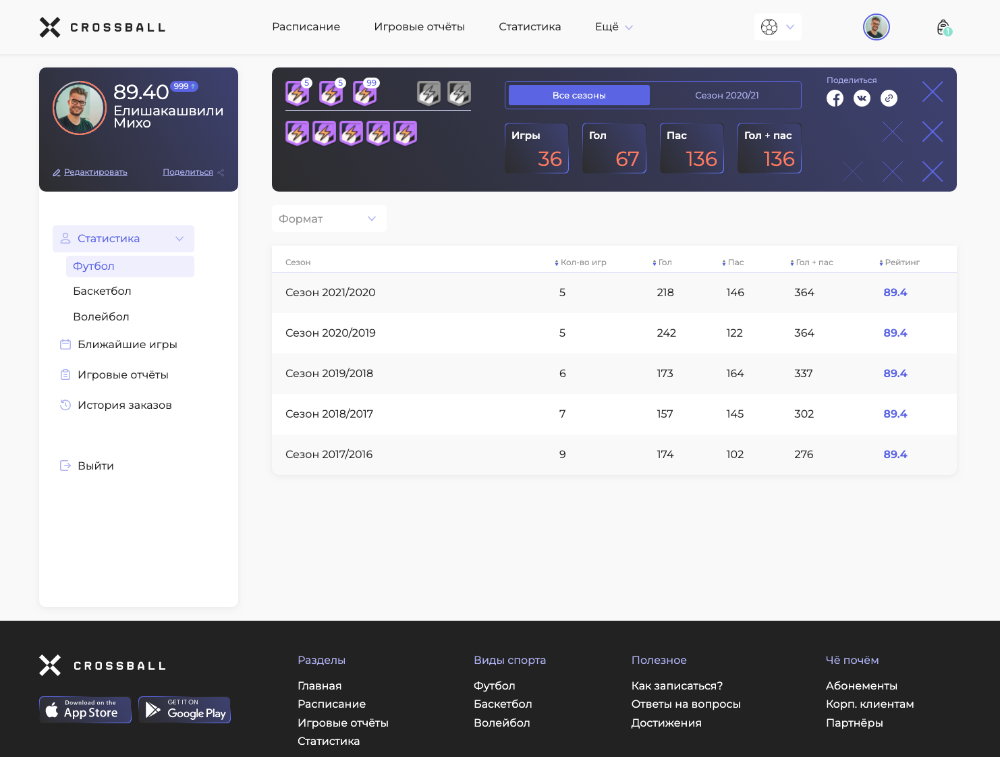

# Test-task Spans Agency

Адаптивная вёрстка под два экрана:
- Desktop - width 1440 px
- Mobile - width 320 px

Динамический вывод таблицы с применением Grid. Сортировка таблицы при клике по названию колонки.

Mockup link: https://www.figma.com/file/OVJ4FGG9gL8IkdW4zWo5xS/Test-task-Spans-Agency

GitHub Pages: https://kvadrofilii.github.io/spans-agency/

Скриншоты выполненного тестового задания:

